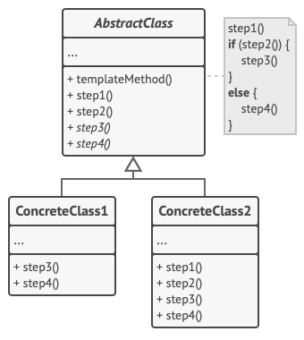

# Template Method Pattern

## Definition
Template Method defines the skeleton of an algorithm in the superclass but 
lets subclasses override specific steps of the algorithm without changing its structure.

## Diagram

1. The Abstract Class declares methods that act as steps of an algorithm, as well as the actual template method which calls these methods in a specific order. The steps may either be declared abstract or have some default implementation.

2. Concrete Classes can override all of the steps, but not the template method itself.

- - [Click Code](concept/example.py)

## Pseudo Example
- [example](pseudocode)

## Other Examples
- problematic code:
  - [redundant_code.java](other_examples/redundant_code.java)
  - 
- apply template pattern:
  - [use_template.java](other_examples/use_template.java) (java ver.)
  - [use_template.py](other_examples/use_template.py) (python ver.)
  - 
- best code:
  - [template and interface+abstract](other_examples/template_with_interface_and_abstract.java) (java ver.)
  - [multiple_inheritance.py](other_examples/multiple_inheritance.py) (python ver.)

## reference
1. https://refactoring.guru/design-patterns/state
2. https://brownbears.tistory.com/571 (in Korean)
