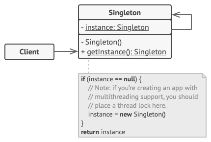

# Singleton Pattern

## Definition
Singleton is a creational design pattern that lets you ensure that a class has only one instance, while providing a global access point to this instance.

## Diagram

The Singleton class declares the static method getInstance that returns the same instance of its own class.

The Singleton’s constructor should be hidden from the client code. Calling the getInstance method should be the only way of getting the Singleton object.

- [Naive Code](concept/naive_example.png)
- [Thread Safe Code](concept/thread_safe_example.png)

## Pseudo Example
- [example](pseudocode)

## source file (python)
- singleton pattern template [HERE](other_examples/singleton_template.py)
- singleton example: [singleton_example.py](other_examples/singleton_example.py)
- singletone example using instance(python only method): [singleton_example2_using_instance.py](other_examples/singleton_example2_using_instance.py)

## reference
1. https://refactoring.guru/design-patterns/singleton
2. https://brownbears.tistory.com/487
